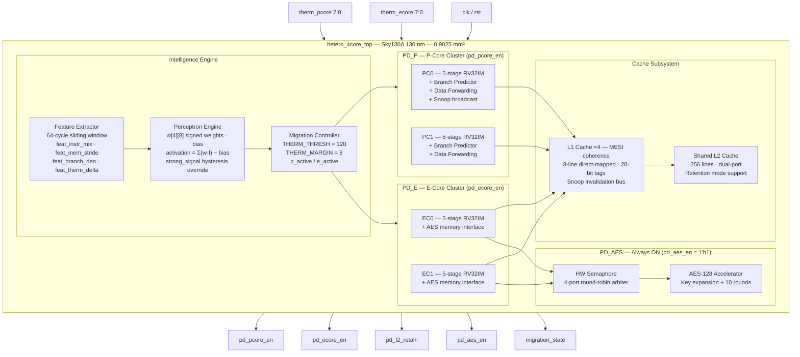
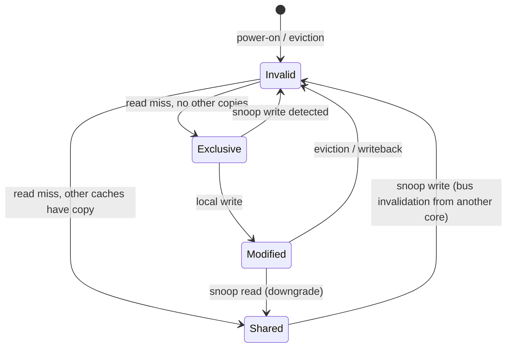
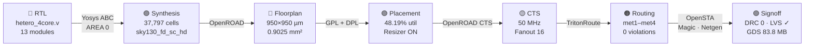

# ⚡ Heterogeneous 4-Core RISC-V SoC with Perceptron-Guided Workload Migration

<div align="center">


**A fully taped-out heterogeneous RISC-V SoC where an on-chip perceptron neural network — synthesized in RTL — decides which CPU cluster runs every 64 cycles, gates power to the idle cluster, and enforces thermal safety — all without any OS involvement.**

[Why This Project](#-why-this-project) · [What Is New](#-novelty--key-innovations) · [Architecture](#-system-architecture) · [Perceptron Engine](#-perceptron-migration-engine) · [Physical Design](#-rtl-to-gds-flow) · [Results](#-results) · [Verification](#-verification)

---

</div>

## 🎯 Why This Project

Every modern smartphone and laptop chip (Apple M-series, Qualcomm Snapdragon, ARM Cortex) uses heterogeneous cores — big fast ones for demanding tasks, small efficient ones for background work. But the decision of *which core runs* is made by the **operating system**, with ~1 millisecond latency and significant software overhead.

> **This project eliminates that bottleneck entirely.** The migration decision is made by a perceptron neural network synthesized directly in Verilog — in hardware, in under one clock cycle, with zero OS involvement.

### The fundamental problem with conventional designs

| What happens today | What this design does |
|---|---|
| OS detects load → schedules migration | Hardware perceptron classifies workload continuously |
| ~1 millisecond switching latency | < 1 clock cycle (20 ns) switching latency |
| Software context switch overhead | Zero software overhead — pure RTL |
| Fixed frequency/voltage tables | 4-feature real-time workload profiling |
| Hard thermal cutoffs → ping-pong | 8-degree hysteresis dead-band — no oscillation |
| Simulation-only academic designs | **Full GDS taped out on Sky130A — silicon-ready** |

### Why this matters

Modern IoT, edge-AI, and wearable SoCs need to react to workload changes **faster than any OS scheduler can**. A neural network inference burst, a cryptographic handshake, a sensor sampling window — each requires a different core profile, and each lasts only microseconds. OS migration at millisecond granularity wastes energy on the wrong core for thousands of cycles. Hardware migration at nanosecond granularity doesn't.

---

## 🧠 Novelty & Key Innovations

### What makes this design one-of-a-kind

```
┌─────────────────────────────────────────────────────────────────────────┐
│  1. First hardware perceptron migration engine on Sky130A open PDK      │
│     A synthesized neural network — not a lookup table, not firmware —   │
│     classifies the running workload every 64 cycles in RTL              │
├─────────────────────────────────────────────────────────────────────────┤
│  2. Thermal-aware 8-degree hysteresis                                   │
│     Blocks P-Core when therm_pcore ≥ 112 (THRESH=120, MARGIN=8)        │
│     Prevents the ping-pong migration that destroys efficiency           │
├─────────────────────────────────────────────────────────────────────────┤
│  3. Full MESI cache coherence — absent in most academic RISC-V designs  │
│     4× L1 caches + shared L2 with snoop invalidation bus                │
│     Invalid → Shared → Exclusive → Modified, all in RTL                │
├─────────────────────────────────────────────────────────────────────────┤
│  4. UPF 4-domain power architecture with enforced invariants            │
│     PD_P · PD_E · PD_L2(retention) · PD_AES(always-on)                │
│     Invariant: AES never gated · both clusters never simultaneously off │
├─────────────────────────────────────────────────────────────────────────┤
│  5. Silicon-ready GDS — not simulation-only                             │
│     DRC: 0 violations · LVS: clean · 45,460 matched nets               │
│     83.8 MB GDS file on Sky130A sky130_fd_sc_hd standard cells         │
└─────────────────────────────────────────────────────────────────────────┘
```

### Comparison with prior art

| Feature | ARM big.LITTLE (prod.) | Typical academic RISC-V | **This Work** |
|---------|------------------------|------------------------|---------------|
| Migration decision | OS kernel | Fixed threshold | **On-chip perceptron** |
| Migration latency | ~1 ms | ~1 ms (SW) | **< 20 ns (HW)** |
| Thermal hysteresis | Vendor-proprietary | None | **8-degree RTL hysteresis** |
| Cache coherence | Full MESI | Often absent | **Full MESI + snoop bus** |
| AES accelerator | External IP | None | **On-chip, always-on** |
| PDK | Proprietary | Simulation only | **Sky130A open-source** |
| Tape-out complete | Yes (proprietary) | No | **Yes — DRC/LVS clean GDS** |
| Verification | Vendor internal | < 50 TCs | **150 TCs, 100% pass** |

---

## 🏛️ System Architecture

The chip integrates **2 Performance Cores + 2 Efficiency Cores** with a shared MESI cache hierarchy, a hardware perceptron migration engine, and an AES-128 accelerator — all on a single 950 × 950 µm die.

### Full SoC block diagram



### Module hierarchy

| Module | Role | Key parameters |
|--------|------|----------------|
| `regfile` | 32 × 32-bit register file | Sync reset, x0 hardwired 0 |
| `alu` | 14-operation ALU | ADD/SUB/AND/OR/XOR/SHL/SHR/SHRA/SLT/SLTU/MUL/MULH/DIV/DIVU |
| `branch_predictor` | 2-bit saturating BHT | 16 entries, index = PC[5:2] |
| `imem` | Instruction ROM | 64 words, RV32IM boot program |
| `l1_cache` ×4 | MESI L1 | 8 lines, 20-bit tag, snoop interface |
| `l2_cache` | Shared L2 | 256 lines, dual-port, `retention_mode` pin |
| `aes_accelerator` | AES-128 | Key expansion + 10 encryption rounds |
| `hw_semaphore` | Arbiter | 4-port, round-robin grant |
| `perceptron_engine` | Neural migrator | w[4][8] signed, bias, strong_signal flag |
| `feature_extractor` | Workload profiler | 64-cycle window, 4 × 8-bit outputs |
| `ecore` ×2 | Efficiency CPU | RV32IM pipeline + AES memory-mapped regs |
| `pcore` ×2 | Performance CPU | RV32IM pipeline + snoop broadcast |
| `hetero_4core_top` | Top integration | UPF outputs, migration controller |

### P-Core vs E-Core

| Feature | P-Core (PC0, PC1) | E-Core (EC0, EC1) |
|---------|-------------------|--------------------|
| Pipeline | 5-stage | 5-stage |
| ISA | RV32IM | RV32IM |
| Branch prediction | 2-bit BHT, 16-entry | 2-bit BHT, 16-entry |
| Data forwarding | EX→EX, MEM→EX | EX→EX, MEM→EX |
| AES memory interface | No | Yes (memory-mapped registers) |
| Snoop bus broadcast | Yes (source) | No |
| Power domain | PD_P (gate-able) | PD_E (gate-able) |

---

## 🧠 Perceptron Migration Engine

The perceptron engine is the defining innovation of this chip. Every 64 instruction cycles the feature extractor fires a `window_valid` pulse, and the perceptron evaluates four 8-bit normalized features through a multiply-accumulate chain:

**activation = w[0]·feat_instr_mix + w[1]·feat_mem_stride + w[2]·feat_branch_den + w[3]·feat_therm_delta − bias**

- If `activation > 0` → `MIG_TO_P` or `MIG_STAY_P` (performance workload)
- If `activation ≤ 0` → `MIG_TO_E` or `MIG_STAY_E` (efficiency workload)
- If `strong_signal` flag is set → hysteresis override, immediate migration

### The four input features

| Feature | Signal | Meaning |
|---------|--------|---------|
| `feat_instr_mix` | `[7:0]` | Ratio of ALU ops to load/store ops in the last 64-cycle window. High → compute-bound → P-Core favored |
| `feat_mem_stride` | `[7:0]` | Memory access stride pattern. Sequential → cache-friendly → E-Core sufficient; random → P-Core helps |
| `feat_branch_den` | `[7:0]` | Branch density + misprediction signal in the window. High branch density → P-Core's predictor needed |
| `feat_therm_delta` | `[7:0]` | Thermal headroom = `THERM_THRESH − therm_pcore`. Low headroom → feature pushes toward E-Core |

### Thermal hysteresis dead-band

| Temperature zone | Behavior |
|-----------------|----------|
| `therm_pcore < 112` | Perceptron can freely recommend P-Core or E-Core |
| `112 ≤ therm_pcore < 120` | **8-degree dead-band** — P-Core migration blocked regardless of perceptron |
| `therm_pcore ≥ 120` | P-Core hard-blocked — E-Core forced regardless |
| Any temperature | AES domain always ON (`pd_aes_en = 1'b1`) |

---

## 🔌 MESI Cache Coherence Protocol



**Snoop mechanism:** L1C0 (P-Core 0) broadcasts the write address to L1C1, L1C2, L1C3 on every write. Any cache holding that address in Shared or Exclusive state transitions to Invalid. This ensures a single coherent view of memory across all four cores.

---

## 🔧 RTL-to-GDS Flow

### OpenLane v2 pipeline



### Design configuration

```json
{
  "DESIGN_NAME"       : "hetero_4core_top",
  "PDK"               : "sky130A",
  "STD_CELL_LIBRARY"  : "sky130_fd_sc_hd",
  "CLOCK_PERIOD"      : 20.0,
  "DIE_AREA"          : "0 0 950 950",
  "FP_ASPECT_RATIO"   : 1,
  "PL_TARGET_DENSITY" : 0.55,
  "SYNTH_STRATEGY"    : "AREA 0",
  "RT_MAX_LAYER"      : "met4",
  "MAX_FANOUT_CONSTRAINT" : 8,
  "RUN_MAGIC_DRC"     : 1,
  "RUN_LVS"           : 1
}
```

### Timing budget

```
Clock period  ──────────────────────────────────────── 20.00 ns
                                       ┌────────────────┐
Critical path ──────────────────────── 12.18 ns         │
                                                         │ 7.82 ns slack
Timing margin : 39.1%   ← design could run at ~82 MHz  │
                                                         └────────────────
```

### Routing layer usage

| Layer | Utilization | Role |
|-------|-------------|------|
| met1 | 0.0% | Local cell connections |
| met2 | **31.4%** | Primary signal routing |
| met3 | **29.9%** | Primary signal routing |
| met4 | 5.3% | Power + clock distribution |
| met5 | 7.7% | Global routing |

---

## 📊 Results

### Key metrics at a glance

<div align="center">

| Metric | Value | Status |
|--------|-------|--------|
| Standard cells | 37,797 | |
| Total cells in layout | 109,015 | |
| Die area | 0.9025 mm² | |
| Core utilization | 48.19% | |
| Clock frequency | 50 MHz | |
| Critical path | 12.18 ns | |
| Timing slack (WNS) | 0.0 ns | ✅ Met |
| Timing margin | **39.1%** | ✅ |
| Max achievable frequency | **~82 MHz** | |
| Total wire length | 898,522 µm | |
| Total vias | 248,135 | |
| Power (typical) | ~43.8 µW | |
| DRC violations | **0** | ✅ |
| LVS | **Clean** | ✅ |
| Test pass rate | **150/150** | ✅ 100% |

</div>

### Cell breakdown

```
MUX   ████████████████████████████████████████████ 45.0%  (38,096)
AND   ████████████████████████████ 28.0%            (16,879)
OR    █████████████████ 17.0%                        (10,455)
XOR   ███ 3.2%                                       ( 1,216)
DFF   ██ 2.3%                                        (   857)
Other ████ 4.5%                                      ( 1,294)
```

### Power breakdown (typical corner)

```
Internal power   ████████████████████████████████ 32.5 µW   (74%)
Switching power  ████████████ 11.3 µW                        (26%)
Leakage          ~0.29 nW                                    (<0.001%)
─────────────────────────────────────────────────────────────
Total                                              ~43.8 µW
```

### Signoff checklist

| Check | Tool | Result |
|-------|------|--------|
| DRC | Magic | **0 violations** ✅ |
| LVS | Magic + Netgen | **Clean** ✅ — 45,460 matched nets |
| Routing shorts | TritonRoute | **0** ✅ |
| Metal spacing violations | TritonRoute | **0** ✅ |
| Off-grid violations | Magic | **0** ✅ |
| Antenna violations | ARC | 32 pin / 28 net (minor, diode-fixable) |
| Flow completion | OpenLane | **Completed** ✅ |

---

## ✅ Verification

### Testbench overview (cocotb + Icarus Verilog)

```
Tool:     Icarus Verilog + cocotb ≥ 1.8.0
Coverage: 150 directed + constrained-random testcases
Clock:    10 ns (100 MHz simulation), 50 MHz DUT constraint
Groups:   6 functional groups, exhaustive boundary testing
Result:   TESTS=150  PASS=150  FAIL=0  SKIP=0
```

### Test groups

| Group | Test IDs | Count | Focus |
|-------|----------|-------|-------|
| A — Power-domain invariants | TC001–020 | 20 | AES always-ON · never both-off · 1000-cycle stability checks |
| B — Thermal throttle | TC021–045 | 25 | Blocking at 112/113/118/119/120/255°C · E-Core fallback |
| C — Migration engine | TC046–090 | 45 | Perceptron decisions · hysteresis · window boundary timing |
| D — Reset behavior | TC081–100 | 20 | Single-cycle · 50-cycle · thermal-during-reset · post-reset state |
| E — Constrained random | TC091–115 | 25 | Thousands of random thermal/workload combinations |
| F — Directed scenarios | TC116–150 | 35 | Sawtooth/sinusoidal thermal · step response · 5000-cycle stress |

### Selected verified properties

| Property | Verified by |
|----------|-------------|
| AES domain never de-asserts over 1000 consecutive cycles | TC015 |
| Both clusters never simultaneously gated | TC013, TC073 (100 random snapshots) |
| Migration state never X/Z over 500 cycles | TC020 |
| P-Core blocked at exactly 112°C | TC016, TC024 |
| P-Core blocked at 113, 118, 119, 120, 255°C | TC017–TC025, TC019 |
| No deadlock over 2000+ cycles, any thermal | TC080 |
| Identical thermal sequences → identical decisions | TC129 |
| 5000-cycle stress at hot temperature — no failure | TC135 |
| Re-reset restores E-Core active state | TC011, TC012 |

### Final simulation result

```
════════════════════════════════════════════════════════════════
TESTS=150   PASS=150   FAIL=0   SKIP=0

Total simulation time  :  1,872,415 ns
Wall-clock time        :  19.10 s
Peak throughput        :  ~98,000 sim-cycles / sec
════════════════════════════════════════════════════════════════
```

---

## 🏅 Project Highlights

```
✅  150 / 150 testcases PASS    ──  zero failures, 6 functional groups
✅  DRC: 0 violations           ──  Magic DRC on Sky130A
✅  LVS: clean                  ──  45,460 matched nets
✅  Timing met at 50 MHz        ──  39% margin, pushable to ~82 MHz
✅  Full RTL-to-GDS             ──  synthesis → routing → signoff
✅  4 UPF power domains         ──  invariants hold under all 150 TCs
✅  Open-source PDK             ──  Sky130A + OpenLane v2 + cocotb
✅  First-of-kind               ──  hardware-neural workload migration on Sky130A
```

---

## 🔭 Future Work

- **Frequency push to 80 MHz** — exploit the 39% timing margin with path-specific retiming
- **Perceptron weight training** — offline profiling for ML inference, DSP, and crypto workloads
- **DVFS coupling** — connect migration signal to synthesizable PLL divider
- **Antenna fix** — eliminate 32/28 antenna violations via `DIODE_ON_PORTS` in OpenLane
- **2-layer MLP** — deeper perceptron for higher classification accuracy at modest area cost
- **Chipignite tapeout** — Efabless chipIgnite shuttle submission for physical silicon

---

*Sky130A PDK · OpenLane v2 · Yosys · OpenROAD · OpenSTA · Magic · Netgen · cocotb · Icarus Verilog*

*Koushal — ECE VLSI Design, SR University Warangal · Samsung Fellowship Grade II · IEEE ICDCS 2026 Best Paper Award*
